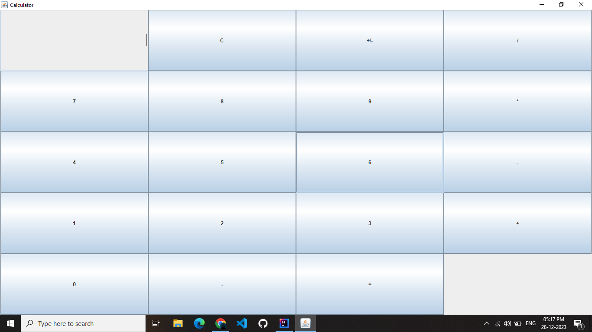

# Simple Java Calculator

This is a simple calculator application written in Java using Swing. It provides a basic graphical user interface for performing arithmetic operations such as addition, subtraction, multiplication, and division.

## Features

- Addition, subtraction, multiplication, and division operations.
- Decimal point and negation functionality.
- Clear button to reset the calculator.
- Responsive layout with buttons for numbers and operations.

## How to Use

1. **Number Buttons:** Click on the number buttons (0-9) to input numbers.
2. **Operation Buttons:** Click on
3. **Equals Button (=):** Calculates the result of the expression.
4. **Clear Button (C):** Clears the input and resets the calculator.
5. **Decimal Button (.):** Adds a decimal point to the current input.
6. **Negation Button (+/-):** Negates the sign of the current input.
 ## Screenshots



 ## Usage

To run the calculator, make sure you have Java installed on your system. Compile and run the `Calculator.java` file:

```bash
javac Calculator.java
java Calculator
